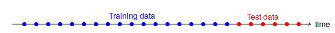
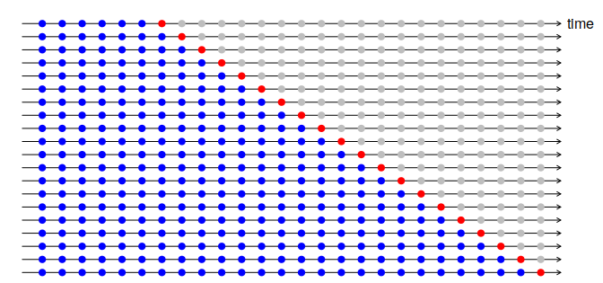

```{r setup, include=FALSE}
knitr::opts_chunk$set(echo = TRUE)
for (package in c("tidyverse","fpp3", "GGally", "ForeCA", "normtest")) {
    if (!require(package, character.only=T, quietly=T)) {
        install.packages(package)
        library(package, character.only=T)
    }
}
```

# Librerías necesarias

- Manipulación de datos y funciones de gráficos:
**tidyverse**
 - Manipulación de series temporales:
**tsibble**
 - Funciones de predicción:
**fable**
 - Gráficos y estadísticas de series temporales:
**feast**
 - Datos de series temporales:
**tsibbledata**
  - Tests de normalidad:
**normtest**

# Almacenamiento de series temporales: Objetos tsibble
Una serie temporal puede considerarse como una lista de números, junto con alguna información sobre los momentos en que se registraron esos números (el índice). Esta información puede ser almacenada como un objeto **tsibble** en R.

Por ejemplo, el conjunto de datos **tourism** contiene los viajes nocturnos trimestrales desde el primer trimestre de 1998 hasta el cuarto trimestre de 2016 en toda Australia.
```{r}
tourism
```

Un objeto **tsibble** permite el almacenamiento y la manipulación de múltiples series temporales en R.
Contiene:

- Un índice: información temporal sobre la observación
- Variable(s) medida(s): números de interés
- Variables clave: identificadores únicos opcionales para cada
serie.

```{r}
mydata <- tsibble(
year = 2012:2016,
y = c(123, 39, 78, 52, 110),
index = year
)
mydata
```

Leer un csv y convertirlo en **tibble**.

```{r}
prison <- readr::read_csv("https://OTexts.com/fpp3/extrafiles/prison_population.csv")
prison <- prison %>%
  mutate(Quarter = yearquarter(Date)) %>%
  select(-Date) %>%
  as_tsibble(key = c(State, Gender, Legal, Indigenous), index = Quarter)

prison
```


# Gráficos de series temporales

Lo primero que hay que hacer en cualquier tarea de análisis de datos es trazar los datos. Los gráficos permiten visualizar muchas características de los datos, incluyendo patrones, observaciones inusuales, cambios en el tiempo y relaciones entre variables.

## Gráfico temporal
Para los datos de las series temporales, el gráfico obvio para empezar es un gráfico temporal (*time plot*). Es decir, las observaciones se trazan contra el tiempo de la observación, con observaciones consecutivas unidas por líneas rectas. A continuación, se muestra la cantidad semanal de pasajeros en clase turista de Ansett Airlines entre las dos ciudades más grandes de Australia.
```{r}
melsyd_economy <- ansett %>%
  filter(Airports == "MEL-SYD", Class=="Economy")

melsyd_economy %>%
  autoplot(Passengers) +
    labs(title = "Ansett economy class passengers", subtitle = "Melbourne-Sydney") +
    xlab("Year")
```

## Gráfico estacional
Un gráfico estacional (*seasonal plot*) es similar a un gráfico temporal, excepto que los datos se representan con respecto a las "estaciones" individuales en las que se observaron los datos. A continuuación, se muestra la producción de cerveza en Australia por trimestre desde 1992.

```{r warning=FALSE}
beer <- aus_production %>%
select(Quarter, Beer) %>%
filter(year(Quarter) >= 1992)

beer %>% gg_season(Beer, labels = "right")
```

## Gráficas de subseries estacionales 

Una gráfica alternativa (*seasonal subseries plots*) que enfatiza los patrones estacionales es donde los datos de cada estación se recogen juntos en mini-tramas temporales separadas.

```{r}
beer %>% gg_subseries(Beer, labels = "right")
```

## Gráfico de dispersión

Los gráficos descritos hasta ahora son útiles para visualizar series temporales individuales. También es útil explorar las relaciones *entre* las series temporales mediante estos gráficos (*scatterplots*).

```{r}
vic_elec %>%
  filter(year(Time) == 2014) %>%
  autoplot(Demand) +
    xlab("Year: 2014") + ylab("GW") +
    ggtitle("Half-hourly electricity demand: Victoria, Australia")
```

```{r}
vic_elec %>%
  filter(year(Time) == 2014) %>%
  autoplot(Temperature) +
    xlab("Year: 2014") + ylab("Degrees Celsius") +
    ggtitle("Half-hourly electricity demand: Victoria, Australia")
```

Podemos estudiar la relación entre la demanda y la temperatura dibujando una serie contra la otra.

```{r}
vic_elec %>%
  filter(year(Time) == 2014) %>%
  ggplot(aes(x = Temperature, y = Demand)) +
    geom_point() +
    ylab("Demand (GW)") + xlab("Temperature (Celsius)")
```

## Matrices de gráficos de dispersión

Cuando hay varias variables potencialmente predictoras, es útil trazar cada variable contra cada una de las otras variables. Consideremos las ocho series temporales que se muestran a continuación que recogen el número de visitantes trimestrales en todos los estados y territorios de Australia.

```{r}
visitors <- tourism %>%
  group_by(State) %>%
  summarise(Trips = sum(Trips))
visitors %>%
  ggplot(aes(x = Quarter, y = Trips)) +
    geom_line() +
    facet_grid(vars(State), scales = "free_y") +
    ylab("Number of visitor nights each quarter (millions)")
```

Para ver las relaciones entre estas ocho series temporales, podemos comparar cada serie temporal con las otras. 

```{r, message=FALSE}
visitors %>%
  spread(State, Trips) %>%
  GGally::ggpairs(columns = 2:9)
```

## Gráficas de retardo

A continuación, se muestran diagramas de dispersión de la producción trimestral de cerveza australiana , en los que el eje horizontal muestra los valores retardados de la serie temporal. Cada gráfico muestra $y_t$ frente a $y_{t-k}$ para diferentes valores de *k*.

```{r}
recent_production <- aus_production %>%
  filter(year(Quarter) >= 1992)
recent_production %>% gg_lag(Beer, geom="point")
```

## Correlograma.

Así como la correlación mide el alcance de una relación lineal entre dos variables, la autocorrelación mide la relación lineal entre los valores retardados de una serie temporal. Normalmente dibujamos el *ACF* para ver cómo cambian las correlaciones con el retardo *k*. La gráfica se denomina correlograma.

```{r}
recent_production %>% ACF(Beer) %>% autoplot()
```

En este gráfico:

- $r_4$es más alto que para los otros retardos. Esto se debe al patrón estacional de los datos: los picos tienden a estar a cuatro trimestres de distancia y las bajadas tienden a estar a cuatro trimestres de distancia.
- $r_2$ es más negativo que para los otros retardos porque los valles tienden a estar dos cuartos detrás de los picos.
Las líneas azules discontinuas indican si las correlaciones son significativamente diferentes de cero. 

# Transformaciones Box-Cox

Una familia de transformaciones útil para estabilizar la varianza de una serie, que incluye tanto logaritmos como transformaciones de potencia, es la familia de transformaciones Box-Cox, que dependen del parámetro λ y se definen de la siguiente manera:
$$w_t = \left\{\begin{array}{ll}
        \log(y_t),      & \quad \lambda = 0; \\
        (y_t^\lambda-1)/\lambda ,         & \quad \lambda \ne 0.
\end{array}\right.
$$\pause

* $\lambda=1$: (No hay transformación sustancial)
* $\lambda=\frac12$: (Raíz cuadrada más transformación lineal)
* $\lambda=0$: (Logaritmo neperiano)
* $\lambda=-1$: (Inversa más 1)

Consideremos una serie heterocedástica como la siguiente.

```{r}
food <- aus_retail %>%
filter(Industry == "Food retailing") %>%
summarise(Turnover = sum(Turnover)) 

food%>% autoplot(Turnover)
```

Para estabilizar la varianza aplicaremos una transformación Box-Cox. Primero se calcula el valor de $\lambda$ adecuado, en este caso 0.0524 y se comprueba gráficamente que consigue una serie homogénea.

```{r}
lambda <- food %>%
features(Turnover, features = guerrero) %>% pull(lambda_guerrero)

food %>% autoplot(box_cox(Turnover,lambda)) +
labs(y = "Box-Cox transformed turnover")
```

Como el valor es muy próximo a cero, se puede transformar mediante un logaritmo natural. Puesto que no afecta al resultado, además es una transformación más simple, como se observa a continuación.

```{r}
food %>% autoplot(log(Turnover)) +
labs(y = "Box-Cox transformed turnover")
```

# Descomposición de series temporales

Si asumimos una descomposición aditiva, entonces podemos escribir:
\[ y_t = S_t + T_t + R_t \] 
$y_t$ son los datos, $S_t$ es el componente estacional, $T_t$ es el componente del ciclo de tendencia y $R_t$ es el componente residual, en el período *t*. Alternativamente, una descomposición multiplicativa se escribiría como:
\[ y_t = S_t \times T_t \times R_t \] 

La descomposición aditiva es la más apropiada si la magnitud de las fluctuaciones estacionales, o la variación alrededor del ciclo de tendencia, no varía con el nivel de la serie temporal. Cuando la variación del patrón estacional, o la variación alrededor del ciclo de tendencia, parece ser proporcional al nivel de la serie temporal, entonces una descomposición multiplicativa es más apropiada. Las descomposiciones multiplicativas son comunes con las series temporales económicas.

Una alternativa al uso de una descomposición multiplicativa es transformar primero los datos hasta que la variación de la serie parezca ser estable en el tiempo, y luego usar una descomposición aditiva. 

Si se ha utilizado una transformación logarítmica, esto equivale a utilizar una descomposición multiplicativa porque:

\[y_t = S_t \times T_t \times R_t \ \text{es equivalente a}\ log(y_t) = log(S_t) + log(T_t) + log(R_t)\]

Existen múltiples algoritmos de descomposición que serán más o menos útiles dependiendo de las características de la serie.

## Descomposición clásica

El método clásico de descomposición se originó en la década de 1920. Es un procedimiento relativamente simple y constituye el punto de partida de la mayoría de los otros métodos de descomposición de series temporales. Hay dos formas de descomposición clásica: una descomposición aditiva y una descomposición multiplicativa. Estas se describen a continuación para una serie temporal con un período estacional *m* (por ejemplo, $m=4$ para los datos trimestrales, $m=12$ para los datos mensuales, $m=7$ para los datos diarios con un patrón semanal).

En la descomposición clásica, asumimos que el componente estacional es constante de año en año. Para la estacionalidad multiplicativa, los *m* valores que forman el componente estacional se denominan a veces "índices estacionales".

Ejemplo: Empleo en el sector minorista de los Estados Unidos

```{r, warning=FALSE}
us_retail_employment <- us_employment %>%
  filter(year(Month) >= 1990, Title == "Retail Trade") %>%
  select(-Series_ID)

us_retail_employment %>%
  model(classical_decomposition(Employed, type = "additive")) %>%
  components() %>%
  autoplot() + xlab("Year") +
  ggtitle("Classical additive decomposition of total US retail employment")
```

## Descomposición X11

Otro método popular para descomponer los datos trimestrales y mensuales es el método X11, que se originó en la Oficina de Censos de los Estados Unidos y en la Oficina de Estadísticas del Canadá.

Este método se basa en la descomposición clásica, pero incluye muchos pasos y características adicionales. En particular, se dispone de estimaciones del ciclo de tendencia para todas las observaciones, incluidos los puntos finales, y se permite que el componente estacional varíe lentamente a lo largo del tiempo. X11 también tiene algunos métodos sofisticados para manejar la variación de los días laborables, los efectos de las vacaciones y los efectos de los pronosticadores conocidos. Maneja tanto la descomposición aditiva como la multiplicativa. El proceso es completamente automático y tiende a ser muy robusto a los valores atípicos y a los cambios de nivel en las series temporales.

Ejemplo: Empleo en el sector minorista de los Estados Unidos

```{r, warning=FALSE}
x11_dcmp <- us_retail_employment %>%
  model(x11 = feasts:::X11(Employed, type = "additive")) %>%
  components()
autoplot(x11_dcmp) + xlab("Year") +
  ggtitle("Additive X11 decomposition of US retail employment in the US")
```

## Descomposición SEATS

"SEATS" significa "Seasonal Extraction in ARIMA Time Series". Este procedimiento fue desarrollado en el Banco de España, y ahora es ampliamente utilizado por las agencias gubernamentales de todo el mundo. El procedimiento funciona sólo con datos trimestrales y mensuales. Por lo tanto, la estacionalidad de otros tipos, como los datos diarios, o los datos horarios, o los datos semanales, requieren un enfoque alternativo.

Ejemplo: Empleo en el sector minorista de los Estados Unidos

```{r, warning=FALSE}
seats_dcmp <- us_retail_employment %>%
  model(seats = feasts:::SEATS(Employed)) %>%
  components()
autoplot(seats_dcmp) + xlab("Year") +
  ggtitle("SEATS decomposition of total US retail employment")
```

## Descomposición STL
STL es un método versátil y robusto para descomponer series temporales. STL es un acrónimo de "Seasonal and Trend decomposition using Loess", siendo Loess un método para estimar las relaciones no lineales. El método STL fue desarrollado por Cleveland, Cleveland, McRae, & Terpenning (1990).

STL tiene varias ventajas sobre los métodos clásicos de descomposición, SEATS y X11:

 - A diferencia de SEATS y X11, STL manejará cualquier tipo de estacionalidad, no sólo datos mensuales y trimestrales.
 - Se permite que el componente estacional cambie a lo largo del tiempo, y la tasa de cambio puede ser controlada por el usuario.
 - La suavidad del ciclo de tendencia también puede ser controlada por el usuario.
 - Puede ser robusto a los valores atípicos (es decir, el usuario puede especificar una descomposición robusta), de modo que las observaciones ocasionales inusuales no afecten a las estimaciones de los componentes del ciclo de tendencia y estacional. Sin embargo, sí afectarán al componente restante.
 
Por otra parte, el STL tiene algunas desventajas. En particular, no maneja automáticamente la variación de los días laborables o del calendario, y sólo proporciona facilidades para las descomposiciones aditivas.

```{r}
us_retail_employment %>%
  model(STL(Employed ~ trend(window=7) + season(window='periodic'),
    robust = TRUE)) %>%
  components() %>%
  autoplot()
```

# Extracción de características

El paquete **feast** incluye funciones para calcular las características y estadísticas de las series temporales ("FEatures And Statistics from Time Series"). Por ejemplo, las autocorrelaciones discutidas pueden considerarse características de una serie temporal - son resúmenes numéricos calculados a partir de la serie. Otra característica es la estimación de Guerrero del parámetro de transformación Box-Cox - de nuevo, se trata de un número calculado a partir de una serie temporal.

## Estadísticos simples

Cualquier resumen numérico calculado a partir de una serie temporal es una característica de esa serie temporal - la media, el mínimo o el máximo, por ejemplo.

Las características pueden ser calculadas usando la función **features()**. Por ejemplo, calculamos la media de todas las series de los datos de turismo de Australia.

```{r}
tourism %>% features(Trips, list(mean=mean)) %>% arrange(mean)
```

En lugar de calcular una característica a la vez, es conveniente calcular muchas características a la vez. Un breve resumen habitual de un conjunto de datos consiste en calcular cinco estadísticos de resumen: el mínimo, el primer cuartil, la mediana, el tercer cuartil y el máximo. Estos dividen los datos en cuatro secciones de igual tamaño, cada una de las cuales contiene el 25% de los datos. Para calcularlos se puede utilizar la función **quantile()**.

```{r}
tourism %>% features(Trips, quantile, prob=seq(0,1,by=0.25))
```

## Características ACF

Todas las autocorrelaciones de una serie pueden considerarse características de esa serie. También podemos resumir las autocorrelaciones para producir nuevas características; por ejemplo, la suma de los primeros diez coeficientes de autocorrelación al cuadrado es un resumen útil de cuánta autocorrelación hay en una serie, independientemente del retardo.

También podemos calcular las autocorrelaciones de las transformaciones de una serie temporal. Una transformación útil en este contexto es observar los cambios en la serie entre períodos. Es decir, "diferenciamos" los datos y creamos una nueva serie temporal que consiste en las diferencias entre observaciones consecutivas. Entonces podemos calcular las autocorrelaciones de esta nueva serie diferenciada.

Ocasionalmente es útil aplicar la misma operación de diferenciación de nuevo, así que calculamos las diferencias de las diferencias. Las autocorrelaciones de esta doble serie diferenciada pueden proporcionar información útil.

Otro enfoque relacionado es calcular las diferencias estacionales de una serie. Si tuviéramos datos mensuales, por ejemplo, calcularíamos la diferencia entre enero y febrero consecutivos, etc. Esto nos permite ver cómo la serie está cambiando entre años, en lugar de entre meses. Una vez más, las autocorrelaciones de las series diferenciadas estacionalmente pueden proporcionar información útil.

La función **feat_acf()** calcula una selección de las autocorrelaciones que se discuten aquí. Devolverá seis o siete características:

 - El primer coeficiente de autocorrelación de los datos originales.
 - La suma de los cuadrados de los diez primeros coeficientes de autocorrelación de los datos originales.
 - El primer coeficiente de autocorrelación de los datos diferenciados.
 - La suma de los cuadrados de los diez primeros coeficientes de autocorrelación de los datos diferenciados.
 - El primer coeficiente de autocorrelación de los datos dos veces diferenciados.
 - La suma de los cuadrados de los diez primeros coeficientes de autocorrelación a partir de los datos dos veces diferenciados.
 - Para los datos estacionales, también se devuelve el coeficiente de autocorrelación del primer desfase estacional.

Cuando se aplica a los datos de turismo de Australia, obtenemos el siguiente resultado.

```{r}
tourism %>% features(Trips, feat_acf)
```

## Características STL

Las descomposiciones STL son la base de varias características más. Una descomposición en serie temporal puede utilizarse para medir la fuerza de la tendencia y la estacionalidad en una serie temporal. 

En el caso de los datos de tendencias fuertes, los datos ajustados estacionalmente deberían tener mucha más variación que el componente restante. Se define la fuerza de la tendencia como:

$$F_T=\max\left(0, 1-\frac{\text{Var}(R_t)}{\text{Var}(T_t+R_t)}\right)$$
Esto dará una medida de la fuerza de la tendencia entre 0 y 1. Debido a que la varianza del residuo puede ser ocasionalmente incluso mayor que la varianza de los datos ajustados estacionalmente, fijamos el valor mínimo posible de $F_T$ igual a cero.

La fuerza de la estacionalidad se define de manera similar:

$$F_S=\max\left(0, 1-\frac{\text{Var}(R_t)}{\text{Var}(S_t+R_t)}\right)$$

Una serie con fuerza estacional cerca de 0 no muestra casi ninguna estacionalidad, mientras que una serie con una fuerte estacionalidad tendrá $F_S$ cercana a 1. 

Otras características útiles basadas en la STL incluyen la cronología de los picos y los valle - qué mes o trimestre contiene el mayor componente estacional y cuál contiene el menor componente estacional. Esto nos dice algo sobre la naturaleza de la estacionalidad. 

En los datos del turismo australiano, si hay un pico en el trimestre 3, entonces la gente viaja a la región en invierno, mientras que un pico en el trimestre 1 sugiere que la región es más popular en verano.

```{r}
tourism %>% features(Trips, feat_stl)
```

Podemos entonces usar estas características en las gráficas para identificar qué tipo de series están fuertemente en tendencia y cuáles son más estacionales.

```{r}
tourism %>%
  features(Trips, feat_stl) %>%
  ggplot(aes(x=trend_strength, y=seasonal_strength_year, col=Purpose)) +
    geom_point() + facet_wrap(vars(State))
```

Claramente, las series de vacaciones son más estacionales. Las tendencias más fuertes suelen estar en Australia Occidental.

La función **feat_stl()** devuelve varias características más, además de las mencionadas anteriormente.

 - **spikiness** mide la prevalencia de los picos en el componente residual $R_T$.

 - **linearity** mide la linealidad del componente de tendencia de la descomposición del STL. Se basa en el coeficiente de una regresión lineal aplicada al componente de tendencia.
 
 - **curvature** mide la curvatura del componente de tendencia de la descomposición STL. Se basa en el coeficiente de una regresión cuadrática ortogonal aplicada al componente de tendencia.
 
 - **stl_e_acf1** es el primer coeficiente de autocorrelación de la serie residual.
 - **stl_e_acf10** es la suma de los cuadrados de los diez primeros coeficientes de autocorrelación de la serie residual.

## Otras características

Las restantes características del paquete, se enumeran aquí como referencia.

 - **coef_hurst** calculará el coeficiente Hurst de una serie temporal que es una medida de "memoria larga". Una serie con larga memoria tendrá autocorrelaciones significativas para muchos desfases.

 - **spectral_entropy** calculará la entropía espectral (Shannon) de una serie temporal, que es una medida de lo fácil que es predecir la serie. Una serie que tiene una fuerte tendencia y estacionalidad (y por lo tanto es fácil de predecir) tendrá una entropía cercana a 0. Una serie que es muy ruidosa (y por lo tanto es difícil de predecir) tendrá una entropía cercana a 1.

 - **bp_stat** da la estadística Box-Pierce para probar si una serie temporal es ruido blanco, mientras que **bp_pvalue** da el p-valor de esa prueba. 

 - **lb_stat** da el estadístico de Ljung-Box para probar si una serie temporal es ruido blanco, mientras que **lb_pvalue** da el p-valor de esa prueba. 
 
 - La *k*-ésima autocorrelación parcial mide la relación entre las observaciones *k* períodos separados después de eliminar los efectos de las observaciones entre ellos. Así que la primera autocorrelación parcial ($k=1$) es idéntica a la primera autocorrelación, porque no hay nada entre ellas que eliminar. La carcterística **pacf5** contiene la suma de los cuadrados de las cinco primeras autocorrelaciones parciales.
 
  - **diff1_pacf5** contiene la suma de los cuadrados de las primeras cinco autocorrelaciones parciales de los datos diferenciados.
 
 - **diff2_pacf5** contiene la suma de los cuadrados de las primeras cinco autocorrelaciones parciales de los datos diferenciados dos veces.

 - **season_pacf** contiene la autocorrelación parcial del primer retardo estacional.
 
 - **kpss_stat** da la estadístico Kwiatkowski-Phillips-Schmidt-Shin (KPSS) para probar si una serie es estacionaria, mientras que kpss_pvalue da el p-valor de esa prueba. 

 - **pp_stat** da el estadístico Phillips-Perron para probar si una serie es no estacionaria, mientras que pp_pvalue da el p-valor de esa prueba.

 - **ndiffs** da el número de diferencias regulares necesarias para obtener una serie estacionaria basada en la prueba KPSS. 

 - **nsdiffs** da el número de diferencias estacionales necesarias para hacer una serie estacionaria. 
 
  - **var_tiled_mean** da las varianzas de las "medias teseladas" (es decir, las medias de los bloques de observaciones consecutivos no superpuestos). La longitud del mosaico por defecto es 10 (para datos no estacionales) o la longitud del período estacional. Esto se denomina a veces la característica de "estabilidad".

 - **var_tiled_var** da las varianzas de las "varianzas teseladas" (es decir, las varianzas de bloques de observaciones consecutivos no superpuestos). Esto se denomina a veces el rasgo de "bulto".

 - **shift_level_max** encuentra el mayor desplazamiento medio entre dos ventanas deslizantes consecutivas de la serie temporal. Esto es útil para encontrar saltos o caídas repentinas en una serie temporal.

 - **shift_level_index** da el índice en el que se produce el mayor desplazamiento medio.

 - **shift_var_max** encuentra el mayor desplazamiento de la varianza entre dos ventanas deslizantes consecutivas de la serie temporal. Esto es útil para encontrar cambios repentinos en la volatilidad de una serie temporal.
 
 - **hift_var_index** da el índice en el que se produce el mayor desplazamiento medio

 - **shift_kl_max** encuentra el mayor cambio de distribución (basado en la divergencia Kulback-Leibler) entre dos ventanas correderas consecutivas de la serie temporal. Esto es útil para encontrar cambios repentinos en la distribución de una serie temporal.

 - **shift_kl_index** da el índice en el que se produce el mayor desplazamiento de KL.

 - **n_crossing_points** calcula el número de veces que una serie temporal cruza la mediana.

 - **n_flat_spots** calcula el número de secciones de los datos donde la serie es relativamente inalterable.

 - **stat_arch_lm** devuelve el estadístico basado en la prueba del Multiplicador de Lagrange (LM) de Engle (1982) para la heteroscedasticidad condicional autorregresiva (ARCH).
 
 
### Ejemplo: Datos sobre el turismo en Australia {-}

Todas las características incluidas en el paquete de **feasts** pueden ser calculadas en una línea como la siguiente.
```{r}
tourism_features <- tourism %>%
  features(Trips, feature_set(pkgs="feasts"))
tourism_features
```

Esto da 44 características para cada combinación de las tres variables clave  (*Region*, *State* and *Purpose*).

Podemos tratar este **tibble** como cualquier conjunto de datos y analizarlo para encontrar observaciones o grupos de observaciones interesantes.

Podemos hacer matrices de diagramas de dispersión de grupos de características. Por ejemplo, veamos todos los rasgos que implican estacionalidad. También hemos incluido la variable *Purpose*.

```{r, message=FALSE}
tourism_features %>%
  select_at(vars(contains("season"), Purpose)) %>%
  mutate(
    seasonal_peak_year = glue::glue("Q{seasonal_peak_year+1}"),
    seasonal_trough_year = glue::glue("Q{seasonal_trough_year+1}"),
  ) %>%
  GGally::ggpairs(mapping = aes(colour=Purpose))
```

Aquí, la variable *Purpose* está mapeada al color. A continuación se destacan los detalles que pueden apreciarse en la figura.

 - Las tres medidas numéricas relacionadas con la estacionalidad (**seasonal_strength_year**, **season_acf1** y **season_pacf**) están todas correlacionadas positivamente.

 - Tanto el panel inferior izquierdo como el superior derecho muestran que las series más fuertemente estacionales están relacionadas con las vacaciones.

 - Los gráficos de barras en la fila inferior de las columnas **seasonal_peak_year** y **seasonal_trough_year** muestran que los picos estacionales en los viajes de negocios ocurren con mayor frecuencia en el cuarto trimestre, y con menos frecuencia en el segundo trimestre.
 
 Es difícil explorar más que un puñado de variables de esta manera. Una forma útil de manejar muchas más variables es utilizar una técnica de reducción de dimensionalidad como componentes principales. Esto da combinaciones lineales de variables que explican la mayor variación de los datos originales. Podemos calcular los componentes principales de las características del turismo de la siguiente manera.
 
```{r}
library(broom)
pcs <- tourism_features %>%
  select(-State, -Region, -Purpose) %>%
  prcomp(scale=TRUE) %>%
  augment(tourism_features)
pcs %>%
  ggplot(aes(x=.fittedPC1, y=.fittedPC2, col=Purpose)) +
  geom_point() + theme(aspect.ratio=1)
```
 
 Cada punto representa una serie y su ubicación en la gráfica se basa en las 44 características. Podemos observar varios aspectos en base a la representación de las dos primeras componentes. Primero, la serie de vacaciones se comporta de manera muy diferente al resto de la serie. Casi todas las series de vacaciones aparecen en la mitad superior del gráfico, mientras que casi todas las series restantes aparecen en la mitad inferior del gráfico. Claramente, la segunda componente principal distingue entre las vacaciones y otros tipos de viajes.
 
 La gráfica también nos permite identificar series temporales anómalas, series que tienen combinaciones de características inusuales. Éstas aparecen como puntos separados de la mayoría de las series. Hay tres que destacan, y podemos identificar a qué serie corresponden de la siguiente manera.
 
```{r}
outliers <- pcs %>%
  filter(.fittedPC1 > 10.5) %>%
  select(Region, State, Purpose, .fittedPC1, .fittedPC2)
outliers

outliers %>%
  left_join(tourism, by = c("State", "Region", "Purpose")) %>%
  mutate(Series = glue::glue("{State}", "{Region}", "{Purpose}", .sep = "\n\n")) %>%
  ggplot(aes(x = Quarter, y = Trips)) +
    geom_line() +
    facet_grid(Series ~ ., scales='free') +
    ggtitle("Outlying time series in PC space")
```
 
 Podemos especular sobre por qué estas series se parecen inusuales.

 - Melbourne es un destino vacacional inusual porque casi no tiene estacionalidad, mientras que la mayoría de los destinos vacacionales en Australia tienen un turismo altamente estacional.

 - La esquina noroeste de Australia Occidental es inusual porque tiene un aumento en el turismo de negocios en los últimos años de datos, pero poca o ninguna estacionalidad.

 - El extremo sudoccidental de Australia Occidental es inusual porque tiene tanto un aumento del turismo de vacaciones en los últimos años de datos como un alto nivel de estacionalidad.
 
 
# Proceso de *Forecasting*


## Modelos dummy
Algunos métodos de *forecasting* son extremadamente simples y sorprendentemente eficaces. Usaremos cuatro métodos de *forecasting* simples como puntos de referencia.

Para ilustrarlos, utilizaremos la producción trimestral de ladrillos de arcilla australianos entre 1970 y 2004.
```{r}
bricks <- aus_production %>% filter_index("1970 Q1" ~ "2004 Q4")
```

### Media {-}

Aquí, las predicciones de todos los valores futuros son iguales a la media de los datos históricos. Si dejamos que los datos históricos se denoten por $y_{1},\dots,y_{T}$, entonces podemos escribir las predicciones como
$$
  \hat{y}_{T+h|T} = \bar{y} = (y_{1}+\dots+y_{T})/T.
$$
La notación $hat{y}_{T+h|T}$ es una abreviatura de la estimación de $y_{T+h}$ basada en los datos $y_1,\dots,y_T$.

```{r, eval = FALSE}
bricks %>% model(MEAN(Bricks))
```

### Naïve {-}

Las predicciones *naive* son aquellas en las que todas las predicciones se establecen simplemente como el valor de la última observación. Es decir,
$$
    \hat{y}_{T+h|T} = y_{T}.
$$
Este método funciona notablemente bien para muchas series temporales económicas y financieras.


```{r, eval = FALSE}
bricks %>% model(NAIVE(Bricks))
# RW(Bricks) is an equivalent alternative
```

### Naïve estacional {-}

Un método similar es útil para los datos altamente estacionales. En este caso, establecemos cada previsión para que sea igual al último valor observado de la misma estación del año (por ejemplo, el mismo mes del año anterior). Formalmente, la previsión para el instante $T+h$ se escribe como
$$
    \hat{y}_{T+h|T} = y_{T+h-m(k+1)},
$$
donde $m=$ el período estacional, donde $k$ denota la parte entera de $(h-1)/m$. Eso parece más complicado de lo que realmente es. Por ejemplo, con datos mensuales, el pronóstico para todos los valores futuros de febrero es igual al último valor observado de febrero. Con datos trimestrales, el pronóstico de todos los valores futuros del segundo trimestre es igual al último valor observado del segundo trimestre (donde Q2 significa el segundo trimestre). Se aplican normas similares para otros meses y trimestres, y para otros períodos estacionales.


```{r, eval = FALSE}
bricks %>% model(SNAIVE(Bricks ~ lag("year")))
```


### Drift  {-}

Una variación del método *naive* consiste en permitir que las predicciones aumenten o disminuyan con el tiempo, en el que la cantidad de cambio a lo largo del tiempo ("drift") se establece como el cambio medio que se observa en los datos históricos. Así pues, la previsión para el instante $T+h$ viene dada por
$$
 \hat{y}_{T+h|T} = y_{T} + \frac{h}{T-1}\sum_{t=2}^T (y_{t}-y_{t-1}) = y_{T} + h \left( \frac{y_{T} -y_{1}}{T-1}\right).
$$
Esto equivale a trazar una línea entre la primera y la última observación, y a extrapolarla al futuro.

```{r, eval = FALSE}
bricks %>% model(RW(Bricks ~ drift()))
```
```{r}
# Fit the models
bricks_fit <- bricks %>%
  model(
    Mean = MEAN(Bricks),
    `Naïve` = NAIVE(Bricks),
    `Seasonal naïve` = SNAIVE(Bricks),
    Drift = RW(Bricks ~ drift())
  )
# Generate forecasts for 14 quarters
bricks_fc <- bricks_fit %>% forecast(h=14)
# Plot forecasts against actual values
bricks_fc %>%
  autoplot(bricks, level = NULL) +
    ggtitle("Clay brick production in Australia") +
    xlab("Quarter") + ylab("Bricks") +
    guides(colour=guide_legend(title="Forecast"))
```


## Diagnosis de residuos

Un buen método de predicción producirá residuos con las siguientes propiedades:

1. Los residuos no están correlados. Si hay correlaciones entre los residuos, entonces queda información en los residuos que debe ser utilizada en el cálculo de las predicciones.
2. Los residuos tienen una media cero. Si los residuos tienen una media distinta de cero, entonces las predicciones están sesgadas.

**Cualquier método de previsión que no satisfaga estas propiedades puede ser mejorado**. Sin embargo, eso no significa que los métodos de previsión que satisfagan estas propiedades no puedan ser mejorados. Es posible tener varios métodos de previsión diferentes para el mismo conjunto de datos, todos los cuales satisfacen estas propiedades. **La comprobación de estas propiedades es importante** para ver si un método utiliza toda la información disponible, pero no es una buena manera de seleccionar un método de previsión.

Además de estas propiedades esenciales, es útil (pero no necesario) que los residuos tengan también las dos propiedades siguientes.

3. Los residuos tienen una varianza constante. 
4. Los residuos están normalmente distribuidos.

Estas dos propiedades facilitan el cálculo de los intervalos de confianza para las predicciones, pero exísten métodos alternativos para estimar dichos intervalos.

### Ejemplo: *Forecasting* del precio al cierre diario de las acciones de Google {-}

Para los precios e índices de la bolsa de valores, el mejor método de previsión es a menudo el método ingenuo. 

El siguiente gráfico muestra el precio de cierre diario de las acciones de Google para los días de la bolsa durante el año 2015. El gran salto corresponde al 17 de julio de 2015, cuando el precio subió un 16% debido a los resultados inesperados del segundo trimestre. 

```{r}
# Re-index based on trading days
google_stock <- gafa_stock %>%
  filter(Symbol == "GOOG") %>%
  mutate(day = row_number()) %>%
  update_tsibble(index = day, regular = TRUE)
# Filter the year of interest
google_2015 <- google_stock %>% filter(year(Date) == 2015)
# Plot the serie
google_2015 %>% autoplot(Close) +
  xlab("Day") + ylab("Closing Price (US$)") +
  ggtitle("Google Stock in 2015")
```
La función para producir los gráficos de diagnóstico de residuos es la función **gg_tsresiduals()**, que producirá un gráfico temporal, un gráfico de ACF y un histograma de los residuos.
```{r, warning=FALSE}
google_2015 %>% model(NAIVE(Close)) %>% gg_tsresiduals()
```

Analizando estos gráficos obtiene información clave sobre el rendimiento del modelo:
 
 - La media de los residuos es cercana a cero y no hay una correlación significativa en la serie de residuos. 
 
  - El gráfico temporal de los residuos muestra que la variación de los residuos se mantiene muy igual a través de los datos históricos, aparte de la que es atípica, y por lo tanto la variación de los residuos puede ser tratada como constante. 
  
  - El histograma sugiere que los residuos pueden no ser normales - la cola derecha parece un poco demasiado larga, incluso cuando ignoramos el valor atípico. En consecuencia, las previsiones de este método probablemente serán bastante buenas, pero los intervalos de predicción que se calculan suponiendo una distribución normal pueden ser inexactos.

### Prueba de *Portmanteau* para la autocorrelación {-}
Además de mirar la gráfica del ACF, también podemos hacer una prueba más formal de autocorrelación considerando un conjunto de valores $r_k$ ($r_k$ es la autocorrelación para el retardo $k$) como un grupo, en lugar de tratar cada uno por separado.

Probamos si las primeras *h* Las autocorrelaciones son significativamente diferentes de lo que se esperaría de un proceso de ruido blanco. Una prueba para un grupo de autocorrelaciones se llama prueba de *portmanteau*, de una palabra francesa que describe una maleta que contiene varios artículos.

Una de estas pruebas es el test de **Ljung-Box**, basado en el siguiente estadístico

$$
  Q^* = T(T+2) \sum_{k=1}^h (T-k)^{-1}r_k^2.
$$
Grandes valores de $Q^*$ sugieren que las autocorrelaciones no provienen de una serie de ruido blanco. Si las autocorrelaciones vinieran de una serie de ruido blanco, entonces $Q^*$ tendría una distribución $\chi^2$ con $(h - K)$ grados de libertad, donde $K$ es el número de parámetros en el modelo. 

Para el ejemplo de las acciones de Google, el modelo no tiene parámetros, así que $K=0$ en ese caso. (Los valores ajustados y los residuos de un modelo se obtienen con la función **augment()**)

```{r}
aug <- google_2015 %>% model(NAIVE(Close)) %>% augment()
# lag=h and fitdf=K
aug %>% features(.resid, ljung_box, lag=10, dof=0)
```

Los resultados no son significativos (es decir, el *p-valor* es relativamente grande). Por lo tanto, podemos concluir que los residuos no se distinguen de una serie de ruido blanco.

### Test de homocedasticidad

Para contrastar la heterocedasticidad se puede utilizar una regresión lineal que enfrente una medida de centralidad (ejemplo: media) a una medida de dispersión (ejemplo: std).

La pendiente del modelo de regresión 

$$
log(std)=\beta_0+\beta_1log(media) + \epsilon
$$

donde media y std reflejan la media y la desviación típica de conjuntos de observaciones cuyo tamaño es el periodo de estacionalidad (s = 12 en series mensuales, s = 7 en series diarias), permiten determinar el hecho de que la variabilidad de los datos dependa o no del nivel de la serie.

Si el *p-valor* de *log(media)* es grande, entonces puede considerarse 0 y por tanto los residuos son homocedásticos. En caso contrario, la varianza dependería del nivel de los residuos y no se asegura la varianza constante.

### Contrastes de hipótesis para la normalidad {-}

Si queremos realizar una prueba formal de normalidad en los residuos, podemos recurrir al paquete **normtest**, este dispone de 10 test para la normalidad de una muestra. Todo se basan en el contraste:

$H_0:$ los datos proceden de una distribución normal

$H_1:$los datos no proceden de una distribución normal

Por tanto, para cualquiera de los test elegidos si el *p-valor* es menor que $\alpha$, habitualmente 0.05, se rechaza la hipótesis de normalidad. En caso contrario, no se tiene suficiente confianza para rechazar la normalidad.

Un test muy utilizado en series temporales es el test de Jarque-Bera. No requiere estimaciones de los parámetros que caracterizan la normal. El estadístico de Jarque-Bera cuantifica cuánto  se desvían los coeficientes de asimetría y curtosis de los esperados en una distribución normal.

```{r}

## Jarque Bera test
jb.norm.test(na.omit(aug$.resid))

```

Como el *p-valor* es menor que el nivel de significancia 0.05, se rechaza la hipótsis nula de normalidad de los resíduos como habíamos supuesto por el histograma.


## Intervalos de predicción

Un intervalo de predicción da un intervalo dentro del cual esperamos que $y_{t}$ se encuentre con una probabilidad especificada. Un intervalo de predicción puede escribirse como 
$$
  \hat{y}_{T+h|T} \pm c \hat\sigma_h
$$ 
donde $\hat{\sigma}_h$ es una estimación de la desviación estándar de la distribución de la predicción para un horizonte $h$ y $c$ depende de la probabilidad de cobertura.

Habitualmente, suponiendo que los errores de pronóstico se distribuyen normalmente, un intervalo de predicción del 95% para el pronóstico de $h$-paso es
$$
  \hat{y}_{T+h|T} \pm 1.96 \hat\sigma_h,
$$
El valor de los intervalos de las predicciones es que reflejan la incertidumbre de las mismas. Si sólo realizamos predicciones puntuales, no hay forma de saber cómo de precisas son las predicciones. 

Para fabricar un intervalo de predicción, **es necesario tener una estimación de $\sigma_h$**. Para las predicciones con ($h=1$), la desviación estándar de los residuos proporciona una buena estimación de la desviación estándar prevista $\sigma_1$. Para las previsiones en horizontes más lejanos, se requiere un método de cálculo más complicado. **Estos cálculos suponen que los residuos no están correlados.**

Si los residuos no están correlados, tienen mefia cero y además, siguen una distribución normal se puede calcular fácilmente con el paquete **fable** mediante la función **hilo()**. Por ejemplo, aquí está el resultado cuando se utiliza el método *naive* para el precio de las acciones de Google.
```{r}
ci <-google_2015 %>%
  model(NAIVE(Close)) %>%
  forecast(h = 10) %>%
  hilo()  

ci$`80%`[1]
ci$`95%`[1]
```
En el gráfico, los intervalos de predicción se muestran como una región sombreada, con la intensidad de color que indica la probabilidad asociada al intervalo.

```{r}
google_2015 %>%
  model(NAIVE(Close)) %>%
  forecast(h = 10) %>%
  autoplot(google_2015)
```

### Intervalos de predicción mediante *bootstrap* {-}

Cuando no se pueden conseguir unos residuos que sigan una distribución normal, una alternativa es utilizar el *bootstrapping*, que sólo asume que los errores de pronóstico no están correlados.

Un error se define como $e_t = y_t - \hat{y}_{t|t-1}$. Podemos reescribirlo como
$$
  y_t = \hat{y}_{t|t-1} + e_t.
$$
Así que podemos simular la próxima observación de una serie temporal usando
$$
  y_{T+1} = \hat{y}_{T+1|T} + e_{T+1}
$$
donde $\hat{y}_{T+1|T}$ es la predicción a horizonte uno y $e_{T+1}$ es el error futuro desconocido. Asumiendo que los errores futuros serán similares a los errores pasados, podemos sustituir $e_{T+1}$ por un muestreo de la colección de errores que hemos visto en el pasado (es decir, los residuos). Añadiendo la nueva observación simulada a nuestro conjunto de datos, podemos repetir el proceso para obtener
$$
  y_{T+2} = \hat{y}_{T+2|T+1} + e_{T+2}
$$
donde $e_{T+2}$ es otro sorteo de la colección de residuos. Continuando de esta manera, podemos simular un conjunto completo de valores futuros para nuestras series temporales.

Para ver algunos de ellos, podemos usar la función **generate()**. Aquí hemos generado cinco posibles trayectorias artificiales para los próximos 30 días. La variable **.rep** proporciona una nueva clave para el **tsibble**. El siguiente gráfico muestra las cinco trayectorias de muestra junto con los datos históricos.

```{r}
## Fit the model
fit <- google_2015 %>%
  model(NAIVE(Close))
## Generate simulations
sim <- fit %>% generate(h = 30, times = 5, bootstrap = TRUE)

google_2015 %>%
  ggplot(aes(x = day)) +
  geom_line(aes(y = Close)) +
  geom_line(aes(y = .sim, colour = as.factor(.rep)), data = sim) +
  ggtitle("Google closing stock price") +
  guides(col = FALSE)
```


Haciendo esto repetidamente, obtenemos muchos futuros posibles. Luego podemos calcular los intervalos de predicción calculando los percentiles para cada horizonte de predicción. El resultado se llama un intervalo de predicción "bootstrap". 

Este proceso nos permite medir la incertidumbre del futuro utilizando sólo los datos históricos.

Podemos realizarlo mediante la función **forecast()** de manera directa.

```{r}
fit %>% 
  forecast(h = 30, bootstrap = TRUE, times = 100) %>% 
  autoplot(google_2015) +
  ggtitle("Google closing stock price")
```

## Evaluación

Al elegir los modelos, es práctica común separar los datos disponibles en dos partes, los datos de entrenamiento y los datos de test, donde los datos de entrenamiento se utilizan para estimar cualquier parámetro de un método de predicción y los datos de test se utilizan para evaluar su exactitud.



El tamaño del conjunto de tests suele ser de alrededor del 20% de la muestra total, aunque este valor depende de la longitud de la muestra y de la antelación con que se quiera hacer el pronóstico. **Lo ideal es que el conjunto de pruebas sea al menos tan grande como el máximo horizonte de pronóstico requerido**. Cabe señalar los siguientes puntos.

- Un modelo que se ajuste bien a los datos de entrenamiento no necesariamente hará un buen pronóstico.
 - Siempre se puede obtener un ajuste perfecto utilizando un modelo con suficientes parámetros.
 - El sobreajuste de un modelo a los datos es tan malo como no identificar un patrón sistemático en los datos.

### Funciones para dividir una serie temporal {-}

La función **filter()** es útil cuando se extrae una porción de una serie temporal, filtrar en función del índice de los datos es muy fácil con esta función.

```{r}
aus_production %>% filter(year(Quarter) >= 1995)
```

Otra función útil es **slice()**, que permite utilizar índices directamente para elegir un subconjunto de cada grupo. 

```{r}
# Last 20 observations (5 years)
aus_production %>%
  slice(n()-19:0)

# first year of data from each time series
aus_retail %>%
  group_by(State, Industry) %>%
  slice(1:12)
```

Por último, **top_n()** es útil para extraer las observaciones más extremas. 

```{r}
gafa_stock %>%
  group_by(Symbol) %>%
  top_n(1, Close)
```

### Medidas de error

Un "error" de predicción es la diferencia entre un valor observado y su predicción. Aquí "error" no significa un error, sino la parte impredecible de una observación. Puede escribirse como
$$
e_{T+h} = y_{T+h} - \hat{y}_{T+h|T},
$$
donde los datos de entrenamiento están dados por $\{y_1,\dots,y_T\}$ y los de test por $\{y_{T+1},y_{T+2},\dots\}$. 
Note que los errores de predicción son diferentes de los residuos en dos sentidos. Primero, los residuos se calculan en el conjunto de **entrenamiento** mientras que los errores de predicción se calculan en el conjunto de **test**. Segundo, los residuos se basan en los predicciones de **horizonte uno** mientras que los errores de predicción pueden implicar predicciones de **multi-horizonte**.

Podemos medir la precisión de la predicción resumiendo los errores de predicción de diferentes maneras.

### Dependientes de escala {-}
Las dos medidas dependientes de la escala que se utilizan más comúnmente se basan en los errores absolutos o en los errores cuadrados:
\begin{align*}
  \text{Mean absolute error: MAE} & = \text{mean}(|e_{t}|),\\
  \text{Root mean squared error: RMSE} & = \sqrt{\text{mean}(e_{t}^2)}.
\end{align*}
Cuando se comparan los métodos de predicción aplicados a una sola serie temporal, o a varias series temporales con las mismas unidades, el MAE es es fácil de entender y de calcular. Un método de pronóstico que minimice el MAE conducirá a predicciones sobre la mediana, mientras que minimizar el RMSE conducirá a predicciones de la media. 

### Porcentajes {-}
El porcentaje de error viene dado por $p_{t} = 100 e_{t}/y_{t}$. Los errores porcentuales tienen la ventaja de no tener unidades, por lo que se utilizan con frecuencia para comparar el rendimiento de las previsiones entre conjuntos de datos. La medida más comúnmente utilizada es:
$$
 \text{Mean absolute percentage error: MAPE} = \text{mean}(|p_{t}|).
$$

Las medidas basadas en errores porcentuales tienen la desventaja de ser infinitas o indefinidas si $y_{t}=0$ para cualquier $t$ en el período de interés, y de tener valores extremos si cualquier $y_{t}$ está cerca de cero. Otro problema con los errores porcentuales que a menudo se pasa por alto es que asumen que la unidad de medida tiene un cero significativo. Por ejemplo, un error porcentual no tiene sentido cuando se mide la exactitud de los pronósticos de temperatura en las escalas de Fahrenheit o Celsius, porque la temperatura tiene un punto cero arbitrario.


### Escalados {-}
Los errores de escala fueron propuestos como una alternativa al uso de errores de porcentaje cuando se compara la precisión de los pronósticos a través de las series con diferentes unidades. Propusieron escalar los errores basados en el MAE de entrenamiento de un simple método de *forecasting*.

Para una serie temporal no estacional, una forma útil de definir un error escalado utiliza predicciones *naive*:
$$
  q_{j} = \frac{\displaystyle e_{j}}
    {\displaystyle\frac{1}{T-1}\sum_{t=2}^T |y_{t}-y_{t-1}|}.
$$
Para una serie temporal estacional, se define un error escalado mediante predicciones *naive*:
$$
  q_{j} = \frac{\displaystyle e_{j}}
    {\displaystyle\frac{1}{T-m}\sum_{t=m+1}^T |y_{t}-y_{t-m}|}.
$$

Debido a que tanto el numerador como el denominador implican valores en la escala de los datos originales, $q_{j}$ es independiente de la escala de los datos. Un error escalado es menor que uno si surge de una predicción mejor que la media de las predicciones *naïve* calculadas sobre los datos de entrenamiento. Por el contrario, es mayor que uno si la predicción es peor que la media de las predicciones *naïve* calculadas sobre los datos de entrenamiento.

El *mean absolute scaled error* se define como
$$
  \text{MASE} = \text{mean}(|q_{j}|).
$$

### Ejemplo {-}

```{r}
# Traint test split
recent_production <- aus_production %>% filter(year(Quarter) >= 1992)
beer_train <- recent_production %>% filter(year(Quarter) <= 2007)

# Model fit
beer_fit <- beer_train %>%
  model(
    Mean = MEAN(Beer),
    `Naïve` = NAIVE(Beer),
    `Seasonal naïve` = SNAIVE(Beer),
    Drift = RW(Beer ~ drift())
  )

# Forecasting 
beer_fc <- beer_fit %>%
  forecast(h = 10)

# Forecast visualization
beer_fc %>%
  autoplot(filter(aus_production, year(Quarter) >= 1992), level = NULL) +
  xlab("Year") + ylab("Megalitres") +
  ggtitle("Forecasts for quarterly beer production") +
  guides(colour=guide_legend(title="Forecast"))

# Accuracy 
accuracy(beer_fc, recent_production) %>% select(-c(.type, ME, MPE, ACF1, RMSSE ))
```

Es evidente que el método naïve estacional es el mejor para estos datos. A veces, **las diferentes medidas de precisión conducirán a diferentes resultados en cuanto a qué método de predicción es mejor.**

## Validación cruzada

En el caso de las series temporrales hay que  tener especial cuidado con el carácter longitudinal de los datos. Por tanto, el conjunto de entrenamiento consiste sólo en observaciones que se produzcan antes de la observación que forma el conjunto de test.

El siguiente diagrama ilustra la serie de conjuntos de entrenamiento y test, donde las observaciones azules forman los conjuntos de entrenamiento y las observaciones rojas forman los conjuntos de test.



Los conjuntos de test han de seleccionarse de manera que reresenten el horizonte de predicción de interés. Así pues, si nuestro horizonte de predicción es 4, los conjuntos de test a evaluar serán de la siguiente manera.


A continuación, comparamos la precisión obtenida mediante validación cruzada de series temporales con la precisión residual. Una forma rápida de conseguir la división en estos conjuntos es la función **stretch_tsibble()**, que creará nuevos índices para los conjuntos de entrenamiento y test. Esta función guarda todos los subconjuntos en un mismi **tibble**, por lo que, en ocasiones, puede ser más interesante utilizar **pstretch()** para evitar problemas de memoria.

```{r}
# Time series cross-validation accuracy
google_2015_tr <- google_2015 %>%
  slice(1:(n()-1)) %>%
  stretch_tsibble(.init = 3, .step = 1)

fc <- google_2015_tr %>%
  model(RW(Close ~ drift())) %>%
  forecast(h=1)

test_err <- fc %>% 
  accuracy(google_2015) %>% 
  select(-c(Symbol, .model, .type, ME, MPE, ACF1 )) %>% 
  mutate(Evaluation='Cross-validation')

# Residual accuracy
resids <- google_2015 %>% 
  model(RW(Close ~ drift())) %>% 
  accuracy() %>% 
  select(-c(Symbol, .model, .type, ME, MPE, ACF1 )) %>% 
  mutate(Evaluation='Training')

# Show errors together
bind_rows(test_err, resids) %>% select(Evaluation, everything())

```

También se puede analizar el error obtenido en validación cruzada en los distintos horizontes.

```{r, warning=FALSE}
google_2015_tr <- google_2015 %>%
  slice(1:(n()-8)) %>%
  stretch_tsibble(.init = 3, .step = 1)

fc <- google_2015_tr %>%
  model(RW(Close ~ drift())) %>%
  forecast(h=8) %>%
  group_by(.id) %>%
  mutate(h = row_number()) %>%
  ungroup()

fc %>%
  accuracy(google_2015, by = "h") %>%
  ggplot(aes(x = h, y = RMSE)) + geom_point()
```

## Forecasting con descomposición

Asumiendo una descomposición aditiva, la serie temporal descompuesta puede ser escrita como
$$
y_t = \hat{S}_t + \hat{A}_t,
$$
donde $\hat{A}_t = \hat{T}_t+\hat{R}_{t}$ es el componente ajustado estacionalmente. Análogamente para una descomposición multiplicativa.

Para pronosticar una serie temporal descompuesta, predecimos el componente estacional, $S_t$, y el componente ajustado estacionalmente $A_t$, por separado. Se suele suponer que el componente estacional no cambia, o que cambia muy lentamente, por lo que se predice simplemente tomando el último año del componente estimado. En otras palabras, se utiliza un método *naive* estacional para el componente estacional. Aunque podría ajustarse mediante algún otro modelo.

Esto se facilita con la función de modelo **decomposition_model()**, que permite calcular predicciones a través de cualquier descomposición aditiva, utilizando otras funciones de modelo para predecir cada uno de los componentes de la descomposición. Los componentes estacionales del modelo serán pronosticados automáticamente usando **SNAIVE()** si no se especifica un modelo diferente.

```{r}
us_retail_employment %>%
  model(stlf = decomposition_model(
             STL(Employed ~ trend(window = 7), robust = TRUE),
             NAIVE(season_adjust)
  )) %>%
  forecast() %>%
  autoplot(us_retail_employment)
```

# Modelos ARIMA

Los modelos ARIMA proporcionan otro enfoque para la previsión de series temporales, estos modelos tienen como objetivo describir las autocorrelaciones en los datos.

## Estacionariedad y diferenciación

Una serie temporal estacionaria es aquella cuyas propiedades no dependen del momento en que se observa la serie, es decir, cuando la media y la varianza con constantes a lo largo del tiempo. Así pues, las series temporales con tendencias, o con estacionalidad, no son estacionarias. La tendencia y la estacionalidad afectarán al valor de la serie temporal en diferentes momentos. 

Formalmente, una serie es débilmente estacionaria o estacionaria en covarianzas si y sólo si:

  - $E(y_t) = E(y_{t+k}) = \mu$
  - $Var(y_t) = Var(y_{t+k}) = \sigma^2$
  - $cov(y_n, y_{n+k}) = cov(y_m, y_{m+k}) = \gamma_k$ 

Por tanto, una serie de ruido blanco es estacionaria (no importa cuando se observe, debe tener un aspecto muy similar en cualquier momento). Es fácilmente comprobale que tiene media constante, varianza constante y covarianza constante (recordemos que $cov(y_n, y_{n+k}) = corr(y_n, y_{n+k})\sigma_n\sigma_{n+k} = 0$, debido a que las autocorrelaciones en este caso siempre son cero).

En general, una serie temporal estacionaria no tendrá patrones predecibles a largo plazo. Las gráficas temporales mostrarán que la serie es aproximadamente horizontal (aunque es posible algún comportamiento cíclico), con una varianza constante.

### Diferencia regular{-}

Una forma de hacer que una serie temporal no estacionaria sea estacionaria: calcular las diferencias entre observaciones consecutivas. Esto se conoce como diferenciación.

```{r, warning=FALSE}
# Plot the serie
google_2015 %>% autoplot(Close) +
  xlab("Day") + ylab("Closing Price (US$)") +
  ggtitle("Google Stock in 2015")

# Plot the serie
google_2015 %>% autoplot( difference(Close)) +
  xlab("Day") + ylab("Closing Price (US$)") +
  ggtitle("Daily changes in Google Stock in 2015")

google_2015 %>%
  mutate(diff_close = difference(Close)) %>%
  features(diff_close, ljung_box, lag = 10)
```
Se observa que tras la diferenciación la serie pierde la tendencia, siendo claramente estacionaria en media. Además, mediante el test de **Ljung-Box** vemos que no existe autocorrelaciones significativas.

### Diferencia estacional {-}

Una diferencia estacional es la diferencia entre una observación y la anterior de la misma estación. Es decir,
$$
y'_t = y_t - y_{t-m},
$$
donde $m=$el número de estaciones. También se llaman "diferencias de retardo *m*", ya que restamos la observación después de un retardo de *m* períodos.

A veces es necesario tomar tanto una diferencia estacional como una diferencia regular para obtener datos estacionarios. Aquí, los datos se transforman primero utilizando logaritmos (segundo panel), y luego se calculan las diferencias estacionales (tercer panel). Los datos siguen pareciendo algo no estacionarios, por lo que se calculan otras muchas primeras diferencias (panel inferior).

```{r}
PBS %>%
  filter(ATC2 == "H02") %>%
  summarise(Cost = sum(Cost)/1e6) %>%
  transmute(
    `Sales ($million)` = Cost,
    `Log sales` = log(Cost),
    `Annual change in log sales` = difference(log(Cost), 12),
    `Doubly differenced log sales` = difference(difference(log(Cost), 12), 1)
  ) %>%
  gather("Type", "Sales", !!!syms(measured_vars(.)), factor_key = TRUE) %>%
  ggplot(aes(x = Month, y = Sales)) +
  geom_line() +
  facet_grid(vars(Type), scales = "free_y") +
  labs(title = "Corticosteroid drug sales", x = "Year", y = NULL)
```

### Pruebas de raíces unitarias

Una forma de determinar más objetivamente si es necesario diferenciar es utilizar una prueba de raíz unitaria. Se trata de contrastes de hipótesis estadísticos de estacionariedad que están diseñados para determinar si se requiere una diferenciación.

En este análisis, utilizamos el test Kwiatkowski-Phillips-Schmidt-Shin (KPSS) (Kwiatkowski, Phillips, Schmidt, & Shin, 1992). En este contraste, la hipótesis nula es que los datos son estacionarios, y buscamos pruebas de que la hipótesis nula es falsa. En consecuencia, pequeños *p-valores* (por ejemplo, menos de 0,05) sugieren que es necesario diferenciar. 

```{r}
google_2015 %>%
  features(Close, unitroot_kpss)
```
El *p-valor* es menor que 0.05, lo que indica que la hipótesis nula es rechazada. Es decir, los datos no son estacionarios. Podemos diferenciar los datos, y aplicar la prueba de nuevo.

```{r}
google_2015 %>%
  mutate(diff_close = difference(Close)) %>%
  features(diff_close, unitroot_kpss)
```

Esta vez, el estadístico de la prueba es diminuto, el *p-valor* es mayor que 0.05, y está dentro del rango que esperaríamos para los datos estacionarios. Así que podemos concluir que los datos diferenciados son estacionarios.

## Gráficas de autocorrelación y autocorrelación parcial

Normalmente no es posible decir, simplemente a partir de una gráfica temporal, qué valores de $p$ y $q$ son apropiados para los datos. Sin embargo, es posible utilizar las gráfica de ACF y PACF, para determinar los valores apropiados para $p$ y $q$.

Recordemos que un gráfico de ACF muestra las autocorrelaciones que miden la relación entre $y_t$ y $y_{t-k}$ para diferentes valores de $k$. Ahora bien, si $y_t$ y $y_{t-1}$ están correlacionados, entonces $y_{t-1}$ y $y_{t-2}$ también deben estar correlacionados. Sin embargo, $y_t$ y $y_{t-2}$ podrían estar correlacionados, simplemente porque ambos están conectados a $y_{t-1}$.

Para superar este problema, podemos usar **autocorrelaciones parciales**. Estas miden la relación entre $y_{t}$ y $y_{t-k}$ después de eliminar los efectos de los retardos $1, 2, 3, \dots, k - 1$. 
A continuación, se muestran las gráficas de ACF y PACF para los datos de consumo de los EE.UU. Las autocorrelaciones parciales tienen los mismos valores críticos de $\pm 1.96/\sqrt{T}$ como para las autocorrelaciones ordinarias.
```{r}
us_change %>% ACF(Consumption) %>% autoplot()
us_change %>% PACF(Consumption) %>% autoplot()
```
Si los datos proceden de un modelo ARIMA($p$,$d$,0) o ARIMA(0,$d$,$q$), entonces las gráficas del ACF y el PACF son útiles para determinar el valor de $p$ o $q$. 

Los datos pueden seguir un modelo ARIMA($p$,$d$,0) si las gráficas de ACF y PACF de los datos diferenciados muestran los siguientes patrones:

- el ACF decae exponencialmente o es sinusoidal;
- hay un pico significativo en el retraso $p$ en el PACF, pero ninguno más allá del retardo $p$.

Los datos pueden seguir un modelo ARIMA(0,$d$,$q$) si los gráficos del ACF y el PACF de los datos diferenciados muestran los siguientes patrones:

- el PACF decae exponencialmente o es sinusoidal;
- hay un pico significativo en el retraso $q$ en el ACF, pero ninguno más allá del retraso $q$.


Vemos que hay tres picos en el ACF, seguidos de un pico casi significativo en el retardo 4. En el PACF, hay tres picos significativos, y luego no hay picos significativos después (aparte de uno justo fuera de los límites en el retardo 22). 

Podemos ignorar un pico significativo en cada gráfica si está justo fuera de los límites, y no en los primeros retardos. Después de todo, la probabilidad de que una pico sea significativo por casualidad es de una en veinte, y estamos trazando 22 picos en cada gráfico. El patrón en los tres primeros picos es lo que esperaríamos de un ARIMA(3,0,0), ya que el PACF tiende a disminuir. Así que en este caso, el ACF y el PACF nos llevan a pensar que un modelo ARIMA(3,0,0) podría ser apropiado.

Por tanto, ajustemos un model ARIMA(3,0,0), mediante la función **ARIMA()**. Además, obtenemos el resumen del modelo mediante la función **report()**.

```{r}
fit2 <- us_change %>%
  model(ARIMA(Consumption ~ pdq(3,0,0) + PDQ(0,0,0)))
report(fit2)
```

## Estacionariedad e invertibilidad: raíces características


Las condiciones de estacionariedad del modelo son que las raíces complejas de $p$ de $\phi(B)$ se encuentren fuera del círculo de la unidad, y las condiciones de invertibilidad son que las raíces complejas de $q$ de $\theta(B)$ se encuentren fuera del círculo de la unidad. Así que podemos ver si el modelo está cerca de la invertibilidad o de la estacionariedad por un trazado de las raíces en relación con el círculo unitario complejo. 

Para comprobar que se cumplen estas condiciones del polinomio caraterístico, podemos rpresentar las raíces inversas en su lugar, ya que todas ellas deberían estar dentro del círculo unitario. Esto se hace fácilmente con la función **gg_arma()**. Para el modelo ARIMA(3,0,0) ajustado al de consumo de los EE.UU, obtenemos el siguiente gráfico.

```{r}
gg_arma(fit2)
```

Se puede comprobar que las tres raices de la parte autoregresiva están dentro del círculo unidad, por tanto el proceso es estacionario. Al no tener parte de medias móviles, no hay que preocuparse por la invertibilidad.

## Contrastes sobre los parámetros

Si queremos realizar una prueba formal para la significatividad de los parámetros de un ARIMA, podemos hacerlo de una forma similar a cualquier modelo de regresión lineal. Se establece un test-t que evalúa las siguientes hipótesis:

$H_0:\beta_i = 0$ 

$H_1:\beta_i \not = 0$

Por tanto, si el *p-valor* es menor que $\alpha$, habitualmente 0.05, se rechaza la hipótesis nula y el parámetro se considera distinto de cero. En caso contrario, no se tiene suficiente confianza para rechazar la que el parámetro sea nulo.

Para llevar a cabo este test utilizando los objetos **ARIMA** del paquete **fable**, bastará con definir la siguiente función. Puesto que este test se realiza, pero aún no hay ninguna función que muestre su valor. Por tanto, creamos la función **my_t_test()** para acceder y mostrar los datos deseados.

```{r}
my_t_test <- function (object, ...) 
{
  par <- rbind(t_stat=tidy(object)$statistic, p_value=tidy(object)$p.value)
  colnames(par) <- tidy(object)$term
  if (NCOL(par) > 0) {
    cat("\nt-test:\n")
    coef <- round(par, digits = 4)
    print.default(coef, print.gap = 2)
  }
}

my_t_test(fit2)
```

Para el modelo anterior podemos observar que todos los parámetros del modelo son significativos, como se podía deducir de la condición de estacionareidad examinada gráficamente en el apartado anterior.


# Modelos SARIMA

Un modelo SARIMA se forma incluyendo términos estacionales adicionales en los modelos ARIMA que hemos visto hasta ahora. Queda expresado de la siguiente manera:


| ARIMA | $~\underbrace{(p, d, q)}$ | $\underbrace{(P, D, Q)_{m}}$ |
| ----: | :------------------------:| :---------------------------:|
|       | ${\uparrow}$              | ${\uparrow}$                 |
|       | Parte no estacional       | Parte estacional             |
|       | del modelo                | del modelo                   |

donde $m=$ estacionalidad de la serie.

## Gráficas de autocorrelación y autocorrelación parcial

La parte estacional de un modelo AR o MA se verá en los retardos estacionales del PACF y el ACF. Por ejemplo, un modelo ARIMA(0,0,0)(0,0,1)$_{12}$ se mostrará:

- un pico en el desfase 12 en el ACF pero ningún otro pico significativo;
- un decaimiento exponencial en los retardos estacionales del PACF (es decir, en los retardos 12, 24, 36, ...).

De manera similar, un modelo ARIMA(0,0,0)(1,0,0)$_{12}$ mostrará:

- la disminución exponencial de los retardos estacionales del ACF;
- un único pico significativo en el retardo 12 del PACF.

El procedimiento de modelización es casi el mismo que para los datos no estacionales, excepto que necesitamos seleccionar los términos estacionales AR y MA, así como los componentes no estacionales del modelo. El proceso se ilustra mejor mediante ejemplos.

## Ejemplo {-}

Describiremos el procedimiento de modelización estacional de ARIMA utilizando los datos trimestrales del comercio minorista europeo desde 1996 hasta 2011. 

```{r}
eu_retail <- as_tsibble(fpp2::euretail)
eu_retail %>% autoplot(value) + ylab("Retail index") + xlab("Year")
```
Los datos son claramente no estacionarios, con cierta estacionalidad, por lo que primero haremos una diferencia estacional. 

```{r, warning=FALSE}
eu_retail %>% gg_tsdisplay(difference(value, 4), plot_type='partial')
```

Estos también parecen ser no estacionarios, así que tomamos una primera diferencia adicional.

```{r, warning=FALSE}
eu_retail %>% gg_tsdisplay(value %>% difference(4) %>% difference(),
  plot_type='partial')
```

Nuestro objetivo ahora es encontrar un modelo ARIMA apropiado basado en el ACF y el PACF. El pico significativo en el retardo 1 del ACF sugiere un componente MA(1) no estacional, y el pico significativo en el retardo 4 del ACF sugiere un componente MA(1) estacional. Por consiguiente, comenzamos con un modelo ARIMA(0,1,1)(0,1,1) $_4$, que indica una primera diferencia estacional, y componentes MA(1) no estacionales y estacionales. (De manera análoga por la PACF, también podríamos haber empezado con un modelo ARIMA(1,1,0)(1,1,0)$_4$).


```{r, include=FALSE}
my_tsresiduals <- function (data, ...) {
  if (!fabletools::is_mable(data)) {
    abort("gg_tsresiduals() must be used with a mable containing only one model.")
  }
  data <- stats::residuals(data)
  if (n_keys(data) > 1) {
    abort("gg_tsresiduals() must be used with a mable containing only one model.")
  }
  gg_tsdisplay(data, !!sym(".resid"), plot_type = "partial",  
    ...)
}
```


```{r}
fit <- eu_retail %>%
  model(arima = ARIMA(value ~ pdq(0,1,1) + PDQ(0,1,1)))
fit %>% my_tsresiduals()

```


Tanto el ACF como el PACF muestran picos significativos en el desfase 2, y picos casi significativos en el desfase 3, lo que indica que algunos términos no estacionales adicionales deben ser incluidos en el modelo. El AICc del modelo ARIMA(0,1,2)(0,1,1) $_4$ es 74, mientras que el del modelo ARIMA(0,1,3)(0,1,1)$_4$ es 68. Probamos otros modelos con términos AR también, pero ninguno que diera un valor AICc menor. 

En consecuencia, elegimos el modelo ARIMA(0,1,3)(0,1,1)$_4$. Todos los picos están ahora dentro de los límites de importancia, por lo que los residuos parecen ser ruido blanco. La prueba Ljung-Box también muestra que los residuos no tienen autocorrelaciones. Sin embargo los residuos no son normales.

```{r}
# Fit SARIMA
fit <- eu_retail %>%
  model(ARIMA(value ~ pdq(0,1,3) + PDQ(0,1,1)))
report(fit)
# Pormentau test
augment(fit) %>%
  features(.resid, ljung_box)
# Visualise residuals
fit %>% my_tsresiduals()
# Test for gaussian white noise
jb.norm.test(na.omit(augment(fit)$.resid))
```

Por tanto, ya disponemos de un modelo para realizar predicciones. Se puede observar que los intervalos de confianza calculados aumentan mucho con el tiempo dado que estos modelos son de memoria corta (de manera ilustrativa ya que deberíamos simular mediantes boostrap para construirlos, dado que los residuos no son normales).

```{r}
fit %>% forecast(h=12) %>% autoplot(eu_retail)
```

# Etapas para el ajuste de un modelo (S)AR(I)MA: Metodología Box-Jenkins

Los pasos principales en el proceso de ajuste de una serie temporal son:

 1. Hacer estacionaria la serie.
 2. Identificar los órdenes del proceso ARMA subyacente bajo la serie estacionaria.
 3. Contrastar que el proceso residual resultante tras el ajuste es ruido blanco.
 
Estos pasos constituyen la esencia de la metodología Box-Jenkins para el ajuste de series temporales, que detallamos en el siguiente diagrama.


